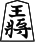
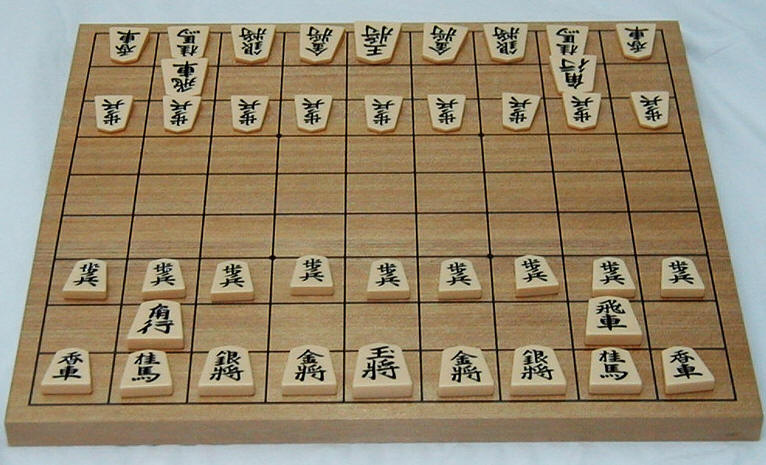

Shogi is the Japanese version of chess. Similar to chess, each player has a set of various pieces, including a King, and, like in chess, the goal is to capture the opponent's king.

This is how the king looks like: .

And this is the starting position:



This is how physical shogi pieces look like:

Do you notice something about the pieces? They don't have a color! Instead, each piece is a pentagon whose tip is pointing towards the opponent.

There is a very good reason for that: unlike chess where captured pieces are dead, in shogi captured pieces can be reused: instead of playing a "normal" move, a player can use one of the pieces they have captured and put (drop) it on the board, as their piece (there are some restrictions on where a piece can be dropped, that will be covered later).

