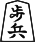
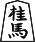
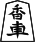
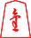
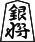
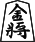
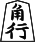
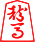
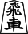

You might have noticed that some pieces (pawns, lances, knights) can only move forward. So you might wonder: what happens when those pieces reach the end of the board? They cannot move after that.

So the answer is: they promote to other pieces! In fact, most of the pieces in shogi (all pieces except the Gold Generals and the Kings) promote, when they reach the sixth rank.

Here is a table describing the promotion system:

| Piece Name | Original Piece | Promoted Piece Name | Promoted piece |
--- | --- | --- | --- |
Pawn | | Tokin | |
Knight |  | Promoted Knight | 
Lance |  | Promoted Lance | 
Silver General |  | Promoted Silver | 
Gold |  | doesn't promote | |
King |  | doesn't promote | |
Bishop |  | Promoted Bishop | 
Rook |  | Promoted Rook | 

The tokin, promoted knight, promoted lance and promoted silver move just like a Gold General, so no more explanations about them are needed. However, the promoted rook and promoted bishop have their own movements, which will be explained in the following pages.

It is important to note that if a player captures a promoted piece, they can only drop its unpromoted version.
